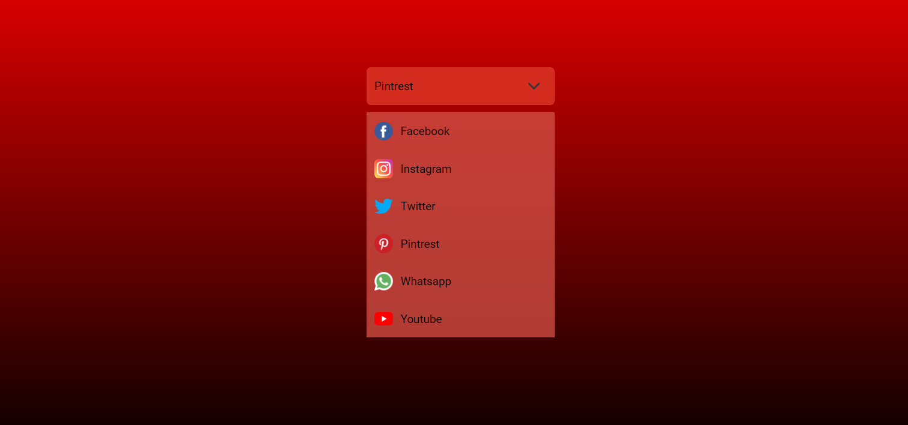

# Select Box

This is a simple implementation of a select box using HTML, CSS, and JavaScript. The select box allows users to choose from a list of options displayed in a dropdown menu.

## Functionality

The select box consists of the following elements:

- `.selectbox`: The main container for the select box.
- `.selectfield`: The field displaying the currently selected option.
- `.expand`: An icon or element indicating the expand/collapse state of the dropdown menu.
- `.lists`: The individual options within the dropdown menu.
- `.main`: The container for the entire select box.
- `.p`: Placeholder for displaying the selected option.

The JavaScript code provides the following functionality:

- Toggling the visibility of the dropdown menu when `.selectbox` is clicked.
- Changing the rotation of the `.expand` icon to indicate the dropdown state.
- Updating the `.p` element with the text of the selected option when an option is clicked.

## Usage

To use this select box:

1. Include the HTML structure for the select box in your HTML file.
2. Add the provided JavaScript code to enable the functionality.
3. Customize the styles and options as needed for your project.
