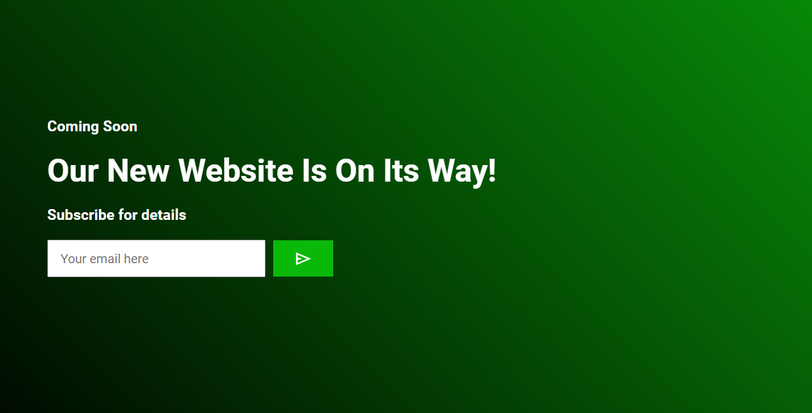

# Email Subscription Form with Google Sheets Integration

This project provides a simple email subscription form that automatically saves entered email addresses into a Google Sheet. It utilizes Google Apps Script to handle form submissions and store data in a Google Sheet.




## Getting Started

To use this email subscription form with Google Sheets integration, follow these steps:

1. **Clone or Download the Repository:** Clone or download the repository containing the necessary files.

2. **Google Sheets Setup:**
    - Create a new Google Sheets document.
    - In the Google Sheets document, create a sheet with appropriate column headers. For example, you might have a column named "Email" to store email addresses.
    - Note the Google Sheets document ID, which can be found in the URL (e.g., `https://docs.google.com/spreadsheets/d/DOCUMENT_ID/edit`).

3. **Google Apps Script Setup:**
    - Open the Google Sheets document.
    - From the menu, go to `Extensions` > `Apps Script`.
    - Delete any code in the script editor and replace it with the provided Google Apps Script code.
    - Save the script.

4. **HTML Form Integration:**
    - Embed the provided HTML form in your website or application.
    - Ensure that the form's action attribute points to the URL of the Google Apps Script web app (`Your URL`).
    - Customize the form as needed.

5. **Testing:**
    - Test the form by entering an email address and submitting it.
    - Check the Google Sheets document to verify that the email address has been successfully saved.

## Script Code Explanation

```javascript
// JavaScript code for handling form submission and displaying messages

let btn = document.querySelector(".btn")
let msg = document.querySelector(".msg")
let input = document.querySelector(".input")

const scriptURL = 'https://script.google.com/macros/s/AKfycbzeDrEIctBvnlBjRzK-P0GOW2V1ti-lRPl9u9vBW5EZFXqsPyjkmKSbm_48Z1niZaul/exec'
const form = document.forms['submit-to-google-sheet']


// Event listener for form submission
form.addEventListener('submit', e => {
    e.preventDefault()
    fetch(scriptURL, { method: 'POST', body: new FormData(form) })
        .then(response => console.log('Success!', response))
        .catch(error => console.error('Error!', error.message))
})

// Event listener for button click
btn.addEventListener("click", () => {
    if (input.value==="") {
        msg.innerHTML = ""
    }
    else{
    msg.innerHTML = "Thanks For Subscribing!"
    setTimeout(() => {
        input.value=""
    }, 0);}
    
    setTimeout(() => {
        msg.innerHTML = ""
    }, 4000);
})


This JavaScript code handles form submission and displays a thank you message when a user subscribes. It sends a POST request to the Google Apps Script web app URL to store the submitted data in Google Sheets.
