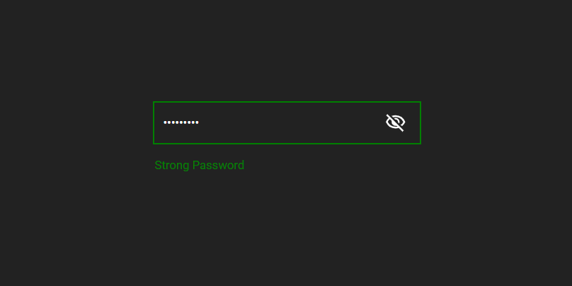

# Password Strength Checker and Toggler

This script provides two main functionalities:

1. **Password Strength Indicator**: It dynamically assesses the strength of a password as it's being typed into the input field and visually indicates whether it's weak, medium, or strong.

2. **Password Visibility Toggler**: It allows users to toggle the visibility of the password they're typing. When the eye icon is clicked, it switches between showing and hiding the password text.

<div style="text-align:center;">

</div>

## Usage

1. Include the necessary HTML structure in your webpage:
    ```html
    <input id="passwordField" type="password">
    <p class="strength"></p>
    
    ```

2. Include the JavaScript code in your webpage, which dynamically updates the password strength and handles password visibility toggling.

3. Ensure that you have two images, one for the eye open state (`eyeopen.svg`) and one for the eye closed state (`eyeclose.svg`).

## Password Strength Indicator

- When the user starts typing in the password field, the script dynamically assesses the strength of the password and updates the strength indicator accordingly.
- Password strength is categorized as weak, medium, or strong based on the length and complexity of the password.

## Password Visibility Toggler

- Users can click on the eye icon to toggle the visibility of the password they're typing.
- When the eye icon is clicked, it changes the input type between "password" and "text", allowing users to either show or hide the password text.
- The eye icon image changes accordingly to represent the current state of password visibility.

## Files

- `index.html`: Sample HTML file demonstrating the usage of the script.
- `style.css`: Sample HTML file demonstrating the usage of the script.
- `script.js`: JavaScript file containing the functionality for password strength indicator and visibility toggler.
- `eyeopen.svg` and `eyeclose.svg`: Images for the eye icon in open and closed states, respectively.

Feel free to customize the script and integrate it into your web projects to enhance password input functionality.
