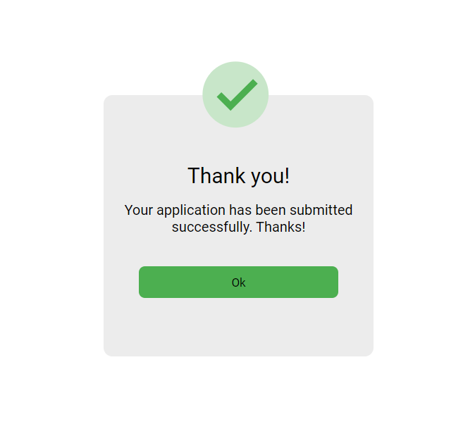

# Popup Feature README

## Description
This README provides an overview of the popup feature implemented in the JavaScript code. The popup feature is triggered upon clicking the submit button, displaying a confirmation message to the user.

## Implementation Details
- The popup feature is implemented using JavaScript.
- Upon clicking the submit button, a popup is dynamically created and appended to the main container of the webpage.
- The popup contains:
  - A checkmark SVG icon indicating successful submission.
  - A thank you message with a confirmation that the application has been submitted successfully.
  - An "Ok" button to close the popup.
- When the "Ok" button is clicked, the popup is removed from the DOM, and the original content of the main container is restored.
- The setupSubmitListener function ensures that the submit button maintains its functionality even after the popup is closed.

## File Structure
- **popup.js**: Contains the JavaScript code for the popup feature.
- **README.md**: This markdown file providing documentation for the popup feature.

## Usage
To integrate the popup feature into your webpage:
1. Include the `popup.js` file in your HTML document.
2. Ensure that the HTML structure includes elements with the following classes:
   - `.main`: Represents the main container where the popup will be displayed.
   - `.submit`: Represents the submit button that triggers the popup.
3. Customize the content of the popup message and styling as needed by modifying the HTML template within the JavaScript code.

